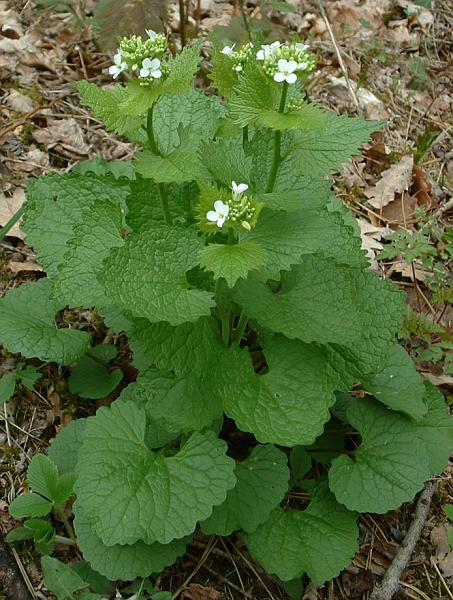
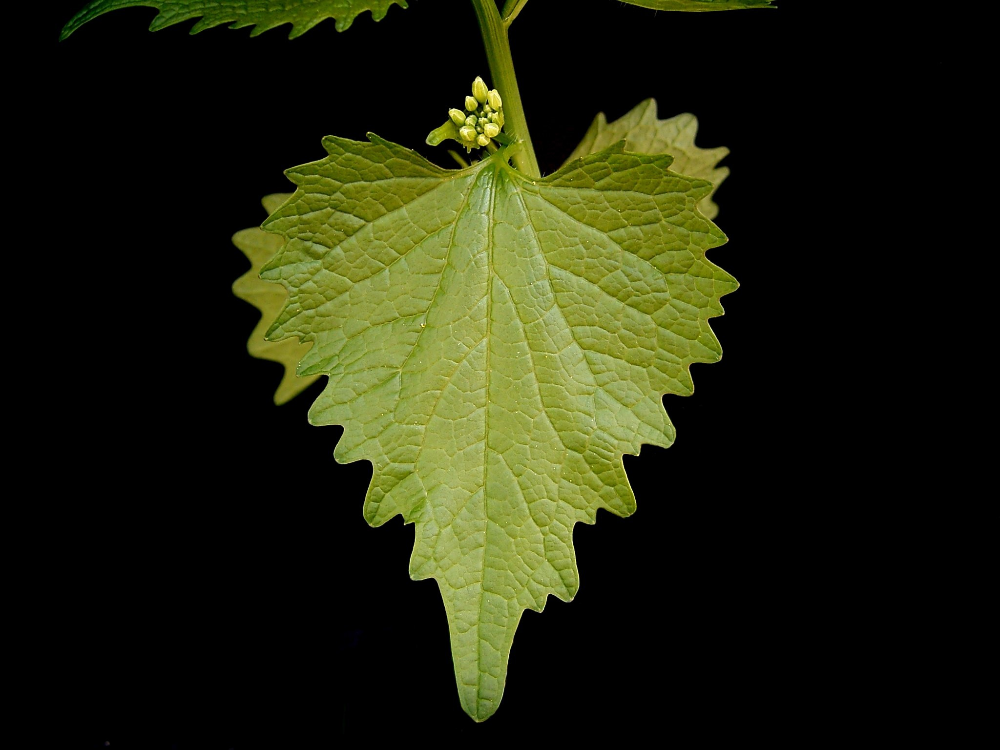

# Alliaire 

Il est possible d'observer de l'alliaire dès le mois d'avril, l'alliaire appréciant beaucoup les lisières des haies et des bois pour l'ombre que l'on y trouve.

_Photo prise par [Jeffdelonge](https://fr.wikipedia.org/wiki/User:Jeffdelonge)_

# Comment l'identifier

L'allaire sent fortement l'ail lorsque l'on frotte ses feuilles, qui sont ridées, dentées sur le pourtour. Elles changent de forme pendant la croissance de la plante : lorsqu'elle fait son apparition au mois de mars, ses feuilles sont nettement arrondies, en forme de coeur, comme sur la photo ci-dessus. Au mois d'avril, lorsque la plante s'élève (de 20 à 70 cm), les feuilles supérieures prennent un forme de plus en plus pointue, comme sur la photo si dessous. 

_Photo prise par Frank Vincentz_

Les fleurs sont blanches, groupées en un bouquet serré au sommet de la tige.

_Photo prise par Frank Vincentz_

# Comment j'en ai trouvé

Cela prolifère pas mal par chez moi, j'en ai trouvé notamment en bordure de chemin. J'ai gouté les feuilles cru, qui ont vraiment un gout d'ail très fort, mais sans l'haleine qui va avec :P

# Propriétés

Toute la plante est utile.

On peut manger les feuilles en cru, ciselées en salade par exemple. Elles sont riches en vitamine C, dépuratives et diurétiques, en plus de soulager la toux et les inflammations de la gorge. Des feuilles fraîches ont des vertus antiseptiques. 

Il est également possible de faire de la moutarde avec les graines.

_Photo prise par [Ewan Munro](https://www.flickr.com/people/55935853@N00)_

Il est recommandé de ne récolter que les quelques feuilles (~4) supérieures de la plante, car les suivantes seraient plus amères.

# Précautions

Il ne faut pas en manger en excès, cela peut devenir irritant.

# Conservation

Cette plante ne se conserve pas bien séchée, car elle perd son gout et devient amer.

## Références

https://jardinage.ooreka.fr/plante/voir/687/alliaire

http://www.gerbeaud.com/jardin/cuisine_fleurs/alliaire-beurre-vinaigre.php3

http://www.cardplayerr.com/DVGXGDQP/

http://www.recettes-et-terroirs.com/produit.php?id=214

http://bleunwennature.canalblog.com/archives/2013/03/12/26630170.html

https://www.lechemindelanature.com/2018/01/15/video-alliaire-le-wasabi-sauvage/

http://lesjardinsdepomone.skynetblogs.be/archive/2009/04/27/l-alliaire-cueillez-maintenant-l-ail-sans-ail-pour-vos-salad.html
