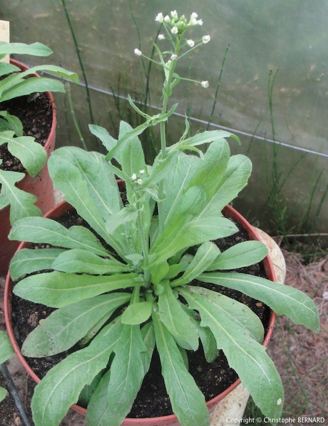
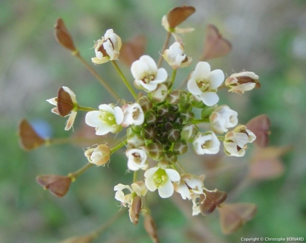
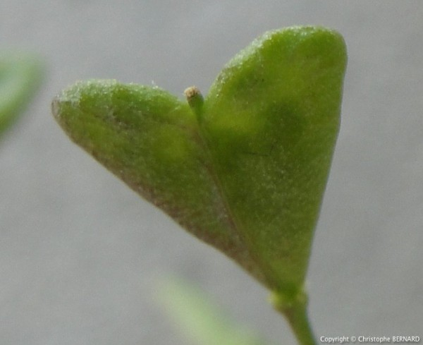
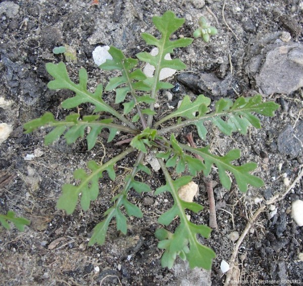

# Bourse à pasteur

la bourse-à-pasteur est l'une des premières plantes à coloniser une terre nue, contribuant à réduire l'érosion due au vent ou à la pluie. La bourse-à-pasteur se récolte toute l'année.

la bourse-à-pasteur pousse dans n'importe quel sol sous n'importe quel climat. On la trouvera dans les terrains vagues ou les clairières, sur le bord des chemins, le long des haies, à l'ombre comme au soleil, en plaine comme en montagne. Elle ne dédaigne pas non plus les fentes des trottoirs.

# Comment l'identifier

C'est une espèce de plante à tiges dressées et velues, qui peuvent atteindre 50 cm de haut.

Les feuilles d’un vert-gris forment des rosettes à leur base, près du sol.

Les fleurs sont petites et blanches, disposées en grappes.

Le fruit, triangulaire et aplati (la bourse), a un goût un peu salé. Il semble vide à la palpation d'où son nom commun de bourse-à-pasteur, les bourses en cuir des bergers ayant jadis cet aspect. Ses pétales sont blancs, longs de 2 à 3 mm.

# Comment j'en ai trouvé

J'ai trouvé de la bourse-à-pasteur en bordure d'un bosquet et également dans les interstices de trottoirs. 

Je n'ai gouté que les feuilles, ce n'est pas encore la saison des fleurs. Leur goût n'est pas très prononcé.

_Photo prise par [Tarquin](https://commons.wikimedia.org/w/index.php?title=User:Tarquin&action=edit&redlink=1)_

# Propriétés

La bourse-à-pasteur à des propriétés hémostatiques (coagulantes), on peut l'utiliser en cas de blessure superficielle par voie externe, ou pour des règles abondantes en tisane.

Par voie externe, on peut appliquer la plante fraîche sur les plaies, particulièrement sur les coupures qui saignent abondamment. De même, on arrêtera un saignement de nez en plaçant dans la narine un morceau d'ouate imbibé du suc de la plante.

On en prépare aussi une infusion en faisant bouillir puis infuser 10 minutes 30 à 60 g de plante par litre d'eau. Prendre trois tasses par jour, entre les repas. La teinture se prépare en faisant macérer pendant 10 jours 350 g de plante fraîche dans un litre d'alcool à 45 %. Prendre 15 à 20 gouttes, 2 ou 3 fois par jour.

Les feuilles se mangent également en salade.

# Précautions

La plante ne semble pas avoir d'effets sur les hémophiles. 

La bourse-à-pasteur peut entraîner une légère baisse de tension, observée surtout sur des sujets âgés souffrant de bradycardie, légèrement aggravée par la plante.

La bourse-à-pasteur pouvant être abortive, elle est fortement déconseillée durant la grossesse.

# Conservation

La plante perds de son efficacité médicinale lorsque elle est conservée, il est plus intéressant de la consommer fraichement cueillie. Les feuilles peuvent se conserver dans un lieu sec, non accessible à une forte lumière et présentant une température ambiante 

## Références

http://www.doctissimo.fr/html/sante/phytotherapie/plante-medicinale/bourse-a-pasteur.htm

https://www.passeportsante.net/fr/Solutions/HerbierMedicinal/Plante.aspx?doc=bourse_pasteur_hm

https://www.altheaprovence.com/bourse-a-pasteur-capsella-bursa-pastoris/

https://fr.wikipedia.org/wiki/Capsella_bursa-pastoris

http://mieux-se-connaitre.com/2013/12/la-bourse-a-pasteur/
