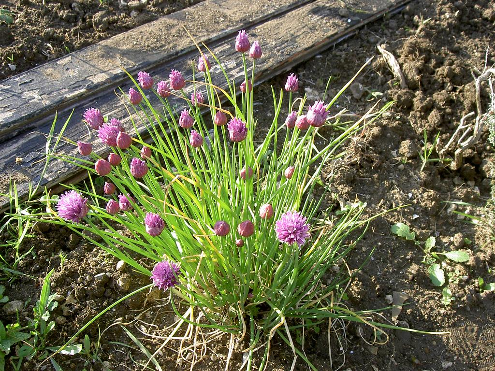
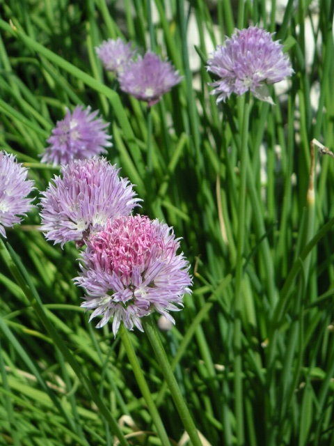

# Ciboulette

C'est sans doute l’aromate le plus facile à trouver dans la nature française. Il pousse un peu partout , dans les prés, les pelouses, ou en bordure de chemin en toute saison, sauf lors d’un hiver rigoureux.

Ses feuilles ne résistent pas au gel hivernal mais sa souche oui, elle renait donc lorsque les températures se réchauffent.

_Photo prise par [Tipiac](https://fr.wikipedia.org/wiki/Utilisateur:Tipiac)_

# Comment l'identifier

De loin, il ressemble à une herbe, mais il forme en réalité des feuilles tubulaires qui exhalent une forte odeur qui fait penser à la ciboulette ou à l’échalote. On le trouve très facilement, en grandes colonies.

La ciboulette fait des fleurs mauves durant l'été

_Photo prise par [Jean-Jacques MILAN](https://fr.wikibooks.org/wiki/Mod%C3%A8le:Jean-Jacques_MILAN)_

# Comment j'en ai trouvé

J'ai trouvé en bordure d'un prairie, au bord d'une petite route.

J'ai gouté en croquant dans les feuilles, leur goût est vraiment prononcé par rapport à ce que j'attendais :D

Cela est dûe au fait que la ciboulette sauvage a un arôme plus fort que la ciboulette cultivée, et car on a l'habitude de la consommée en toute petite quantitée.

# Propriétés

La ciboulette peut être utilisée dans les plats afin d'apporter une douce saveur légèrement aillée.

Étant riche en vitamines K, la ciboulette consommée en grande quantitée favorise la coagulation.

# Précautions

La vitamine K, nécessaire entre autres à la coagulation du sang, peut être fabriquée par l’organisme en plus de se retrouver dans certains aliments. Consommer de la ciboulette peut faire varier le taux de vitamines K, ce qui est peu recommandé avec la prise de médicaments anticoagulants.

# Conservation

On conseille l’utilisation de feuilles et fleurs fraîches, cependant vous pouvez conserver cette plantes en la congélant.

## Références

http://www.plusbonquenature.fr/cueillettes/ail-champetre/

https://www.passeportsante.net/fr/Nutrition/EncyclopedieAliments/Fiche.aspx?doc=ciboulette_nu

https://jardinage.lemonde.fr/dossier-181-ciboulette-allium-schoenoprasum-fines-herbes.html

https://fr.wikipedia.org/wiki/Ciboulette_(botanique)
