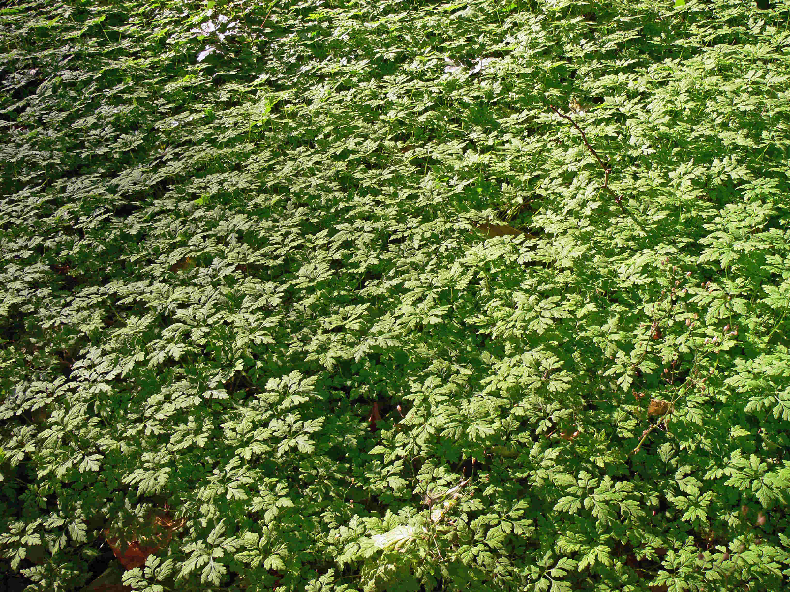
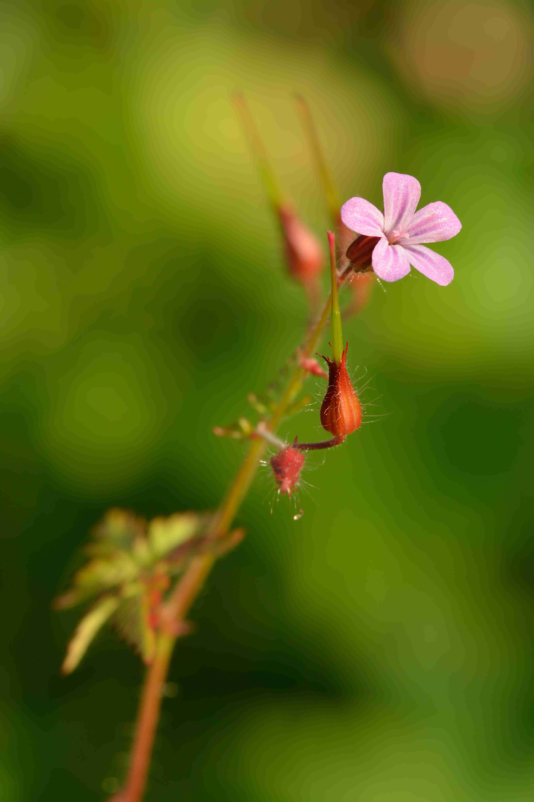
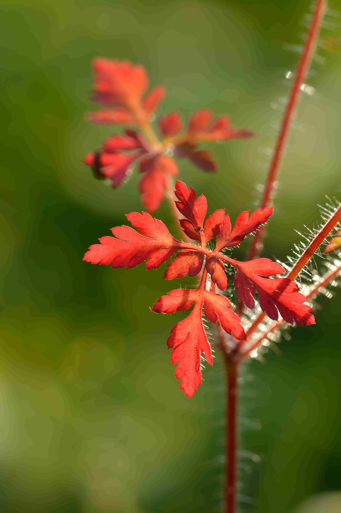

# Géranium Herbe à Robert

Le géranium est une plante ornementale qui offre également de nombreux bienfaits et vertus pour la santé.

L'herbe à Robert affectionne les pieds de murs, certains vieux murs et murets et les milieux légèrement anthropisés (bords des chemins, des haies, des bois, ...).

Elle peut se trouver par banc dense en milieux humide/frais et ensoleillés mais pas trop. 

_Photo de [Lamiot](https://commons.wikimedia.org/wiki/User:Lamiot)_

# Comment l'identifier

L'herbe à robert est facilement repérable à l'odeur âcre de ses tiges, angulaires pourpres, qui portent un feuillage de fougère velouté ponctué de fleurs roses à 5 pétales une fois en fleurs.

_Photo de [Iifar](https://commons.wikimedia.org/wiki/User:Iifar)_

# Comment j'en ai trouvé

J'ai trouvé de l'herbe à robert en bordure d'un chemin en forêt, cela faisait un banc. 

Je n'ai pas encore gouté cette plantes, que je n'ai trouvée que sous forme de feuilles, je les ai rammassée pendant un footing, et elles n'avaient pas une belle tête en arrivant, la faute à mon téléphone qui les à écrasées :S

Je gouterais dans les prochains jours, je vais vous tenir au courant :-)

_Photo de [Iifar](https://commons.wikimedia.org/wiki/User:Iifar)_

# Propriétés

Vous pouvez vous frotter la peau avec ses feuilles comme répulsif contre les moustiques, la nature est bien faite, ces deux espèces poussent dans les mêmes milieux :-) !

L'infusion de plante entière (20g par litre d'eau) sans les racines, cueillie au moment de la floraison, est hémostatique, antispasmodique, astringente, hypoglycémiante, tonique, diurétique et cicatrisante.

L'huile essentielle est antiseptique et stimule les défenses immunitaires.

# Conservation

Vous pouvez conserver cette plante en la faisant sécher le plus rapidement possible après l'avoir récoltée (voir https://fr.wikihow.com/faire-s%C3%A9cher-des-herbes)

## Références

http://www.jardiner-malin.fr/sante/geranium-bienfaits-vertus.html

https://fr.wikipedia.org/wiki/G%C3%A9ranium_Herbe_%C3%A0_Robert#Usages

https://jardinage.ooreka.fr/plante/voir/1917/herbe-a-robert

http://www.fleurs-des-champs.com/fiche_geranium_robertianum.html
