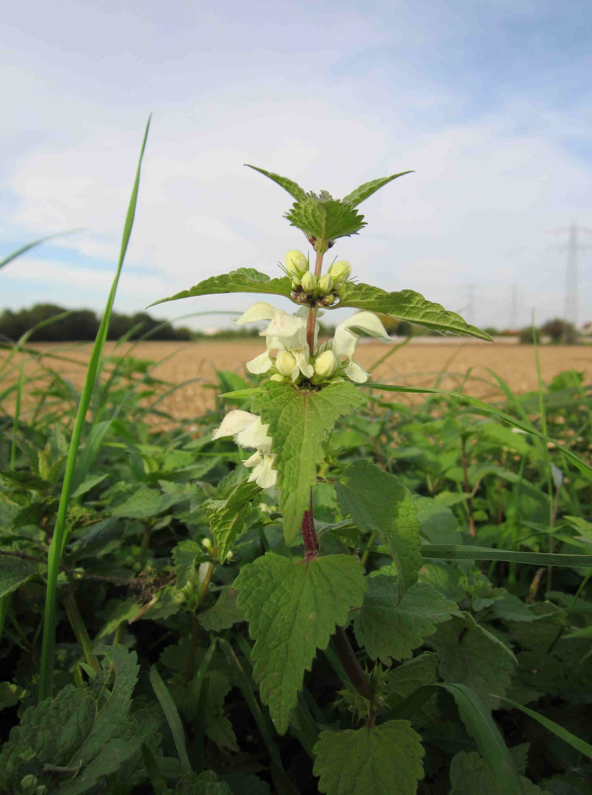
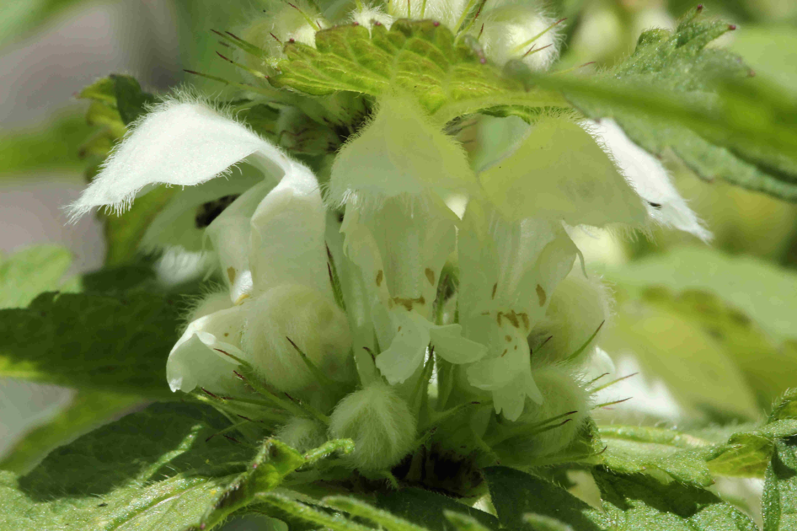
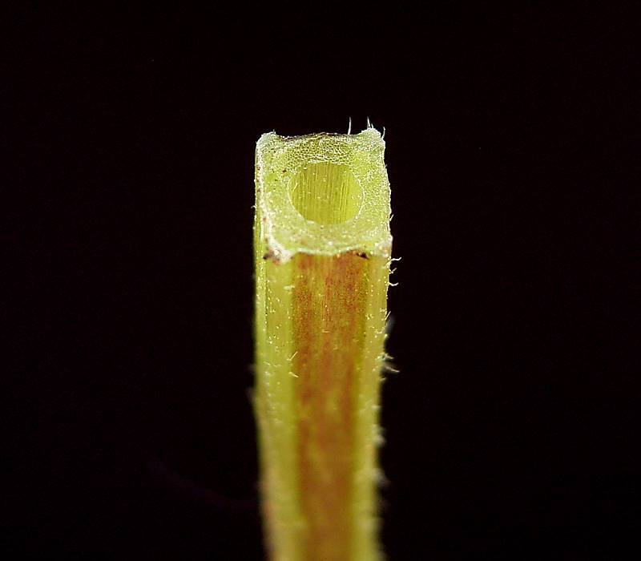

# Lamier blanc

Lamier blanc est une espèce que l'on trouve à proximité ou mélangé avec les colonies d'orties. En effet, c'est un bon atout pour éviter les prédateurs que de ressembler à une plante urticante !

_Photo prise par [AnRo0002](https://commons.wikimedia.org/wiki/User:AnRo0002)_

# Comment l'identifier

Le lamier blanc ressemble fortement à une ortie mais possède des fleurs blanches à la base des feuilles et sa tige est creuse et carrée. Ce plus ce n'est pas urticant.

_Photo prise par [Coyau](https://commons.wikimedia.org/wiki/User:Coyau)_ 

_Photo prise par Frank Vincentz_

# Comment j'en ai trouvé

J'en ai trouvé en bordure de chemin. J'ai gouté les feuilles cru, qui ont un gout que je ne saurais qualifier, ce n'est pas mon gout préféré :S

# Propriétés

Les feuilles et les sommités cueillies avant la floraison se mangent cuites en lasagnes, en potage ou comme des épinards (parfois les jeunes feuilles crues en salade). La base des fleurs, riche en nectar, a une saveur sucrée.

Bien d'autres lamiers sont comestibles: le lamier pourpre, le lamier jaune, le lamier tacheté, le lamier maculé, le lamier à longues fleurs.

Essentiellement utilisée en infusion, à raison d’un minimum de 10 g de sommités fleuries pour 1 litre d’eau et d’un maximum de 30 g, on peut en boire plusieurs tasses par jour et ceci permet de lutter contre les menstruations trop abondantes ou irrégulières. Elles sont un bon dépuratif qui permet l'élimination rénale et digestive de l'acide urique: il est donc adapté au traitement de la goutte.

# Précautions

Pas d'effets indésirables connus.

# Conservation

Vous pouvez conserver les feuilles de cette plante en la faisant sécher le plus rapidement possible après l'avoir récoltée (voir https://fr.wikihow.com/faire-s%C3%A9cher-des-herbes)

## Références

https://www.mr-plantes.com/2010/08/lamier-blanc-lamium-album/

https://www.lessentieldejulien.com/2013/05/mon-doux-lamier-pourquoi-on-aime-lortie-blanche-au-printemps/

http://www.doctissimo.fr/html/sante/phytotherapie/plante-medicinale/lamier-blanc.htm

http://santetoujours.fr/plantes-medicinales/pm-lamier-blanc

http://www.jardin-et-ecotourisme.fr/lamier-blanc-406.htm

https://www.notretemps.com/sante/lamier-blanc-exces-acide-urique,i8479

http://www.medisite.fr/dictionnaire-des-plantes-medicinales-lamier-blanc.646097.8.html

https://fr.wikipedia.org/wiki/Lamier
