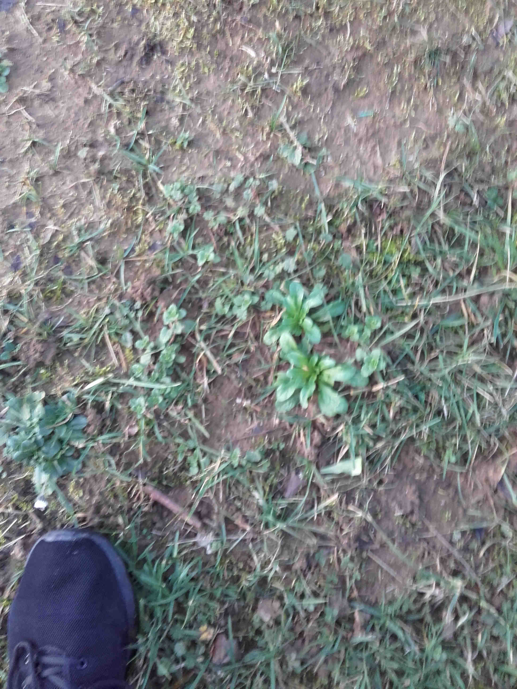

# Mâche

La mâche est fréquente dans toute la France. Elle peut se manger cru ou cuite comme des épinards. Les feuilles se développent tout l'hiver.

_Photo prise par [geoffreypiotrowski](https://www.behance.net/geoffreypiotrowski)_

# Comment l'identifier

La Mâche sauvage est une plante annuelle mesurant 5 à 12 cm de diamètre. La tige, peut atteindre 40 cm de hauteur à la floraison, est grêle, dressée et fourchue.

Les feuilles allongées et spatulées, entières ou légèrement dentées. Elles sont superposées à la base et formant ainsi de petites touffes en rosettes. Elles sont opposées sur la tige.

Les fleurs, bleu-pâle, lilas pâle ou presque blanches, sont minuscules (2 à 3 mm de diamètre), regroupées en inflorescence ou parfois solitaires. Elles ont 5 pétales soudés. La mâche est en fleur d'avril à juin. Les fleurs sont tout a fait comestibles, il faut juste enlever la tige qui est un peu dure.

Le fruit fait 2 mm de diamètre, il est généralement glabre et aplati, ridé sur les 2 faces.

Les racines sont très courtes, il est aisé de retirer la plante du sol entièrement.

La mâche peut pousser aussi bien à l'horizontal qu'à la verticale, ce qui fait qu'on la trouve au bord des chemins et dans les fossés, les prairies sèches, jardins, terrains incultes, fossés, mais aussi sur les murs... 

# Comment j'en ai trouvé

J'ai trouvé de la mâche, sur la bordure d'un bosquet en sortie de bois. 

Je n'ai gouté que les feuilles, ce n'est pas encore la saison des fleurs. Leur goût est connu, on en trouve dans la plupart des supermarchés.

_Photo prise par [Tarquin](https://commons.wikimedia.org/w/index.php?title=User:Tarquin&action=edit&redlink=1)_

# Propriétés

Cette doucette est riche en bêta-carotène, vitamines A, vitamines C et en fer. Elle favorise la digestion (laxatif), calme la nervosité et est excellente à manger, crue en salade, seule ou mélangée.

# Conservation

La plante peut se conserver dans un lieu sec, non accessible à une forte lumière et présentant une température ambiante. 

## Références

https://www.passeportsante.net/fr/Nutrition/EncyclopedieAliments/Fiche.aspx?doc=mache_nu

http://floredesenlisse.hautetfort.com/archive/2009/02/26/la-mache-sauvage-valerianacees.html

http://floramyno.com/ordrealpha_test.php?message=MACHE%20SAUVAGE

https://permaforet.blogspot.fr/2015/01/le-biotope-de-la-mache.html
