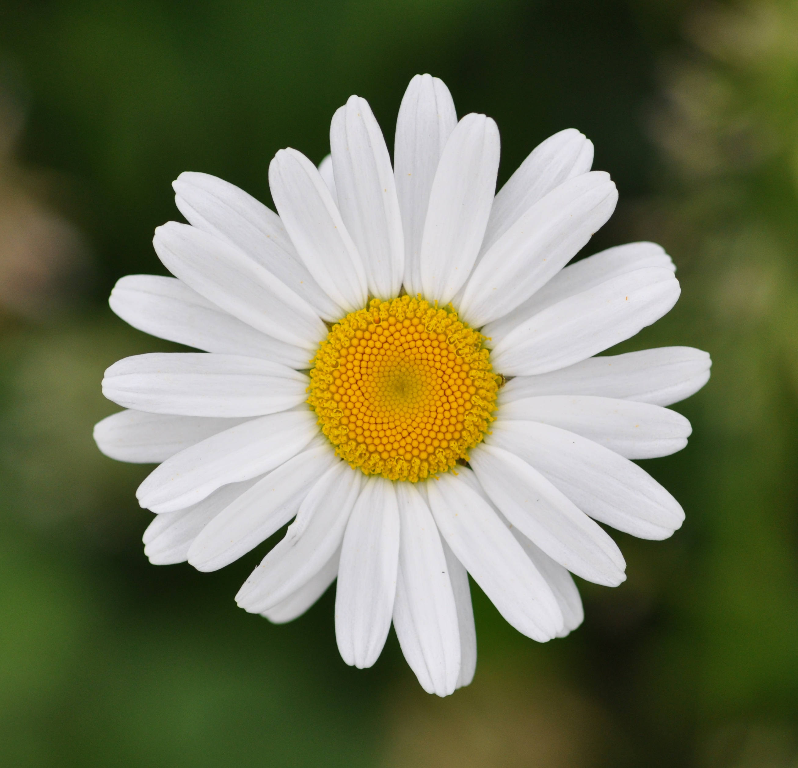

# Marguerite

La marguerite se rencontre à peu près partout que ce soit dans les champs, les pâturages ou le long des routes, c'est une plante très commune dans toute l'europe.

Les marguerites aiment à peu près tous les types de sol mais fleurissent beaucoup mieux en situation ensoleillée.

_Photo de [Magnus Manske](https://commons.wikimedia.org/wiki/User:Magnus_Manske)_

# Comment l'identifier

La fleur de marguerite est simple, blanche et possède de 20 à 30 pétales, avec un coeur jaune.

_Photo de [Quartl](https://commons.wikimedia.org/wiki/User:Quartl)_

# Comment j'en ai trouvé

J'ai trouvé des dans le jardin de ma mère, où cette espèce prolifère :-)

J'ai gouté les pétales qui n'ont pas vraiment de goût et le centre qui lui est très bon, bien plus prononcé, c'est une saveur difficile à décrire.

# Propriétés

Les feuilles jeunes et fraiches de marguerite se consomment en salade. Le bouton floral se consomme cru ou comme des câpres.

On utilise les fleurs séchées en infusion. La marguerite possède des propriétés calmantes, digestives, astringente tout comme la camomille qui est de la même famille. Une marguerite par tasse d`eau est suffisant et on ne doit pas prolonger au-delà de quelques jours.

# Conservation

Vous pouvez conserver cette plante en la faisant sécher le plus rapidement possible après l'avoir récoltée (voir https://fr.wikihow.com/faire-s%C3%A9cher-des-herbes)

## Références

http://www.herbes-medicinales.ca/herbes-medicinales/marguerite.html

https://fr.wikipedia.org/wiki/Marguerite_commune

http://www.jardiner-malin.fr/fiche/marguerite-fleur.html
