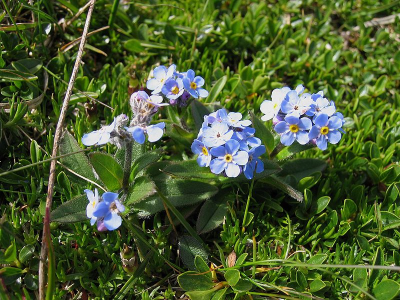
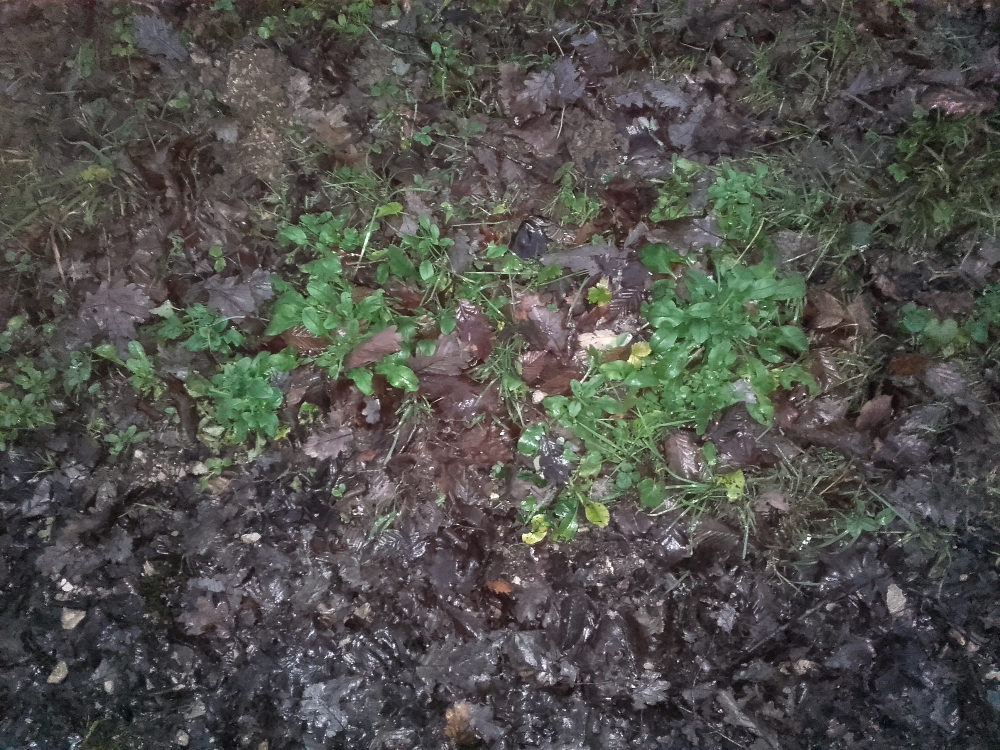
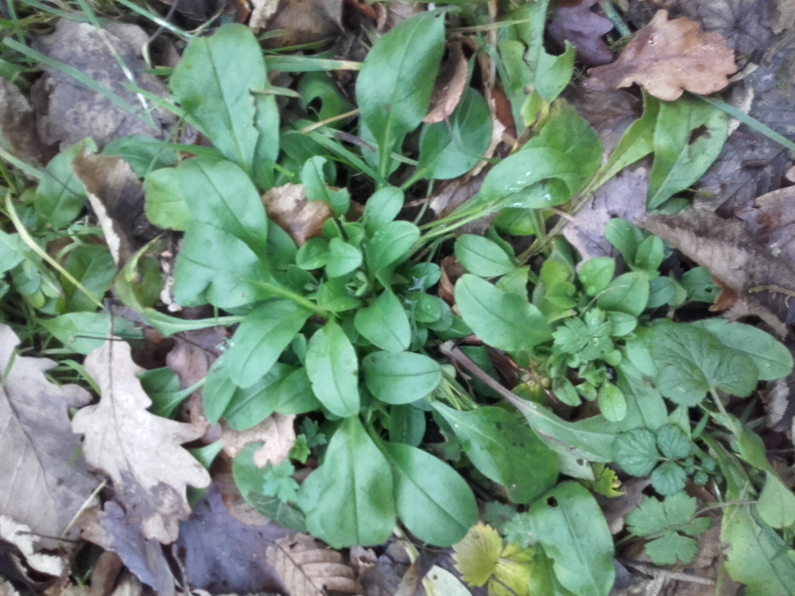

# Myosotis

Le myosotis n’est pas une plante rare, elle est disponible un peu partout dans le monde entier. Cette espèce a la particularité de se ressemer facilement. Sans entretien, elle peut très vite envahir un jardin. Il appartient à la famille des boraginacées et compte près d’une centaine d’espèces.

# Comment l'identifier

Ses feuilles sont d'un vert clair, recouvertes de poils, de forme allongée et plutôt molles. Les fleurs blanches, bleues ou roses apparaissent de mai à juillet. Cette plante vivace peut faire jusqu'a 40 centimètres à la fin de sa croissance. Lorsqu'il n'y à pas de fleurs, cela ressemble à la mâche, en un peu plus foncé, et avec des poils sur les feuilles.

On trouve le Myosotis en Europe jusqu'à 2000 m d'altitude en moyenne. Il affectionne les sols humides, par exemple la lisière de forêt ou le bord des chemins.

# Comment j'en ai trouvé

J'ai trouvé du Myosotis des forêts, il est possible d'en trouver dans les bois et les prairies. J'avais repéré un amas de petites plantes ressemblant à de la mache sauvage lors d'une ballade en sur une véloroute dans une forêt. En repassant je m'y suis intéressé de plus près.

Je n'ai gouté que les feuilles. Leur goût m'as agréablement surpris, c'est assez frais :-)

# Propriétés

En décoction cela a un effet immediatemment revigorant sur l’organisme. La consommation de cette plante est recommandée pour traiter l'asthénie (fatigue généralisée) grâce à sa richesse en potassium.

La plante a de réelles actions apaisantes et relaxantes sur le système nerveux, ce qui en font un puissant sédatif. C’est l’un des anti-inflammatoires naturels les plus employés, pour soulager les lésions génitales, les stomatites, les fractures ou encore les manifestations rhumatismales. Le myosotis soulage rapidement les inflammations oculaires et particulièrement la conjonctivite.

# Précautions

Le myosotis contient beaucoup de potassium. Consommée en excès, cela peut causer des troubles digestifs, voir de l'insuffisance rénale.

Il ne faut utiliser le myosotis chez les touts-petits, sans l’avis d’un médecin. Son utilisation durant la gestation n’est pas spécialement contre-indiquée, toutefois il est plus prudent de demander conseil à un gynécologue avant d’y recourir. 

# Conservation

La plante peut se conserver dans un lieu sec, non accessible à une forte lumière et présentant une température ambiante. 

## Références

https://www.mr-plantes.com/2011/04/myosotis-myosotis-alpina/

http://www.bien-etre-naturel.info/plantes/myosotis.html

http://lamotte.pagesperso-orange.fr/pages/fm3.htm

https://www.mr-plantes.com/2010/11/potassium-kalium/
