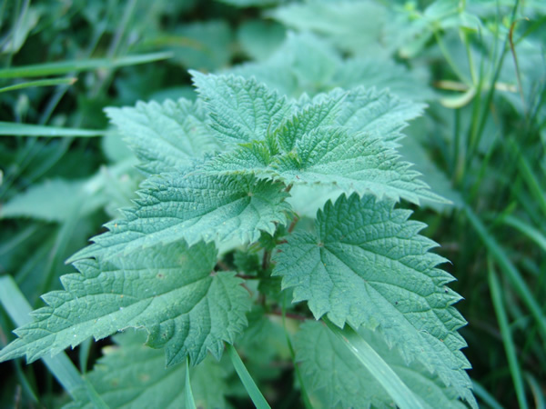
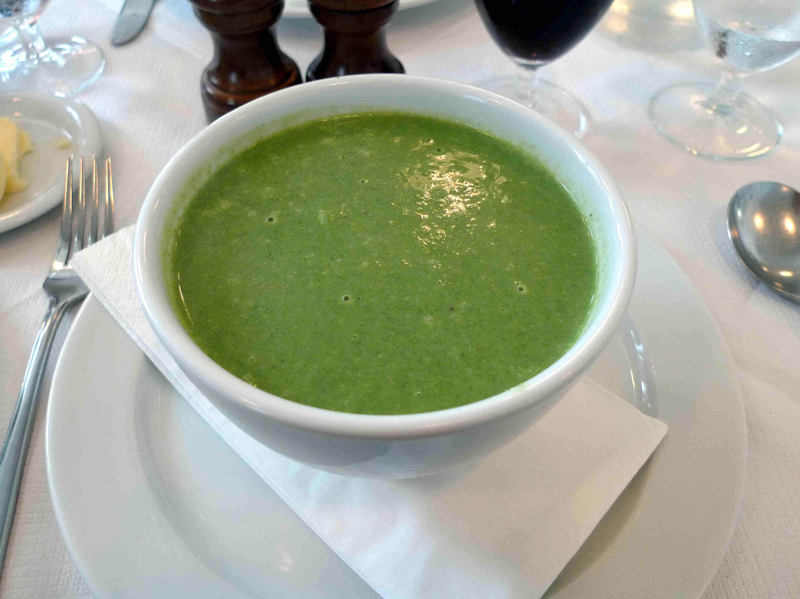

# Ortie 

Il est possible d'observer des orties au bord des chemins, dans les fossés ou encore dans les sous bois, de mars à novembre !

Il est préférable de récolter les feuilles au printemps ou au début de l’été, avant que la plante ne devienne trop coriace.

_Photo prise par [Spone](https://fr.wikipedia.org/wiki/Utilisateur:Spone)_

# Comment l'identifier

La méthode la plus simple et la plus efficace pour identifier l'ortie est sans conteste de s'y frotter. Seule la partie supérieur des feuilles est urticante.

Mais il y a aussi des façon moins douloureuses. L'ortie pousse sur une seule et très longue tige unique.

Ses feuilles sont toujours profondément dentelées et poussent par paires opposées sur la tige. Les tiges présentent des poils urticants évidents. À la fin de l'été, les graines se retrouvent par grappes bien garnies sur la tige près des feuilles.

# Comment j'en ai trouvé

Cela prolifère, j'en ai trouvé dans en bordure de chemin. J'ai gouté les feuilles cru, qui sont vraiment délicieuse ! Cela me rappel un goût de légume que je n'arrive pas à identifier.

# Propriétés

Toute la plante est utile.

On peut manger les feuilles en cru, pour cela il faut casser les poils urticants présent sur le dessus de la feuille. Plier en deux la feuille, la face du dessus à l'intérieur, puis rouler en compressant pour casser les pics. Les feuilles peuvent également se manger cuites comme des épinards, ou pour faire une soupe ou une thisane.

_Photo prise par [Ewan Munro](https://www.flickr.com/people/55935853@N00)_

Il est recommandé de ne récolter que les quelques feuilles (~4) supérieures de la plante, car les suivantes seraient plus amères.

les pourcentages qui suivent sont le pourcentage par rapport aux apports journaliers recommandés, pour 100 grammes d'ortie consommée.

L’ortie est riche en minéraux et oligo-éléments, notamment en fer (128%) et en magnésium (118%), mais aussi en calcium (194%), phosphore (55%), potassium (47%), manganèse (441% !), sélénium et zinc (51%). Elle contient par ailleurs des vitamines A (137%), B, C (111%) et K.

De plus, les fibres de la tige peuvent servir pour fabriquer des cordages :-)

# Précautions

Il est important de s'assurer que l'ortie n'est pas issue d'un sol contaminé au plomb, car l'ortie l'accumule tout aussi efficacement le plomb que les autres minéraux.

# Conservation

Vous pouvez conserver les feuilles de cette plante en la faisant sécher le plus rapidement possible après l'avoir récoltée (voir https://fr.wikihow.com/faire-s%C3%A9cher-des-herbes)

## Références

http://vegecru.com/ortie

http://apprendre-a-manger.com/comment-preparer-orties-fer-folates-infusion-grossesse/

https://gourmandiseschroniques.blogspot.fr/2012/05/lortie-mode-demploi-ou-comment-sen.html

http://plantescomestiblesetmedicinales.over-blog.com/article-l-ortie-une-championne-de-la-nutrition-105458305.html

http://home.naturopathe.over-blog.com/article-toutes-les-recettes-et-astuces-pour-cuisiner-l-ortie-74281068.html

http://www.jeanpierrepoulin.com/Ortie.htm

http://www.nouvellecuisinebio.com/tisane-ortie.asp

https://pretapousser.fr/magazine/savoir-ortie-bienfaits-cuisiner/
