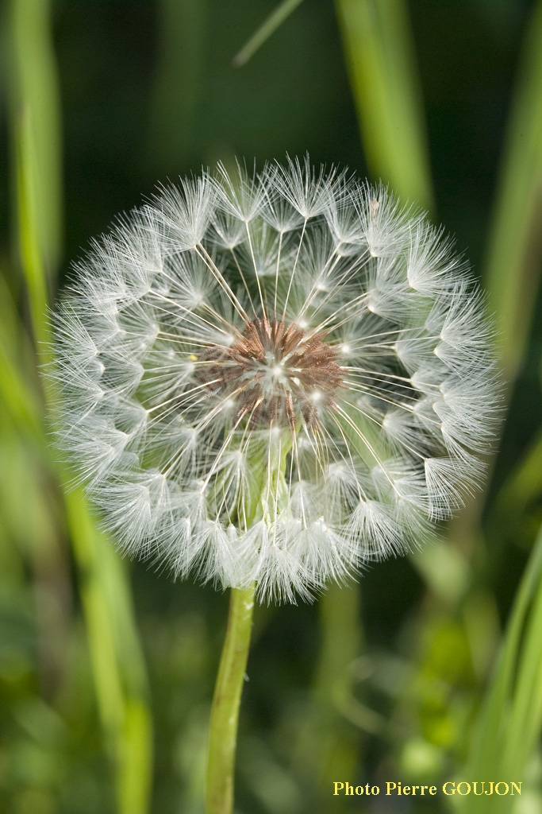

# Pissenlit

il est possible de cueillir les pissenlits dans son jardin ou dans les prairies, là où il y a de l'herbe, il y a sûrement des pissenlits !

On peut récolter ses feuilles de mars jusqu'au mois de novembre, tant que c'est fleuris, mais c'est avant la floraison qu'elles sont le moins amère :-)

_Photo de [abiris.snv.jussieu.fr](http://abiris.snv.jussieu.fr)_

# Comment l'identifier

Les feuilles sont toutes à la base, en rosette. Elles sont profondément découpées. 

_Photo prise par Pierre Goujon_

Les fleurs, jaunes, sont regroupées en capitule, c'est-à-dire que ce qui paraît être une fleur unique est en réalité un amas de fleurs élémentaires, regroupées dans un réceptacle.

_Photo prise par Pierre Goujon_

La tige creuse, et produit un lait blanc en cas de section.

_Photo prise par Pierre Goujon_

le pissenlit finit par produire des fruits blanc/gris extrèmement volatiles que l'on s'amuse souvent à souffler :-P

_Photo prise par Pierre Goujon_

# Comment j'en ai trouvé

Cela prolifère, j'en ai trouvé dans des prés, en bordure de chemin et dans le jardin. J'ai gouté les fleurs et les feuilles, j'aime bien le goût des fleurs.

# Propriétés

Toute la plante est comestible. On peut faire du vin (et donc du vinaigre) à partir de ses fleurs, manger les feuilles en salade ou cuites comme des épinards. Le pissenlit à des propriétées diuréthique, d'où son nom, dérivé de "Pisse au lit". Elle est également riche en vitamines C.

# Conservation

Vous pouvez conserver les feuilles de cette plante en la faisant sécher le plus rapidement possible après l'avoir récoltée (voir https://fr.wikihow.com/faire-s%C3%A9cher-des-herbes)

## Références

http://abiris.snv.jussieu.fr/herbier/Pissenlit.html

https://www.passeportsante.net/fr/Solutions/HerbierMedicinal/Plante.aspx?doc=pissenlit_hm

https://www.comment-economiser.fr/manger-pissenlits.html

http://mangercru100brut.com/pissenlit/

http://vegecru.com/feuille-pissenlit

https://www.maison.com/cuisiner/ingredients/mangez-pissenlits-pas-par-racine-1622/

http://dietetiquetuina.fr/10517/pourquoi-devrions-nous-manger-des-pissenlits/
