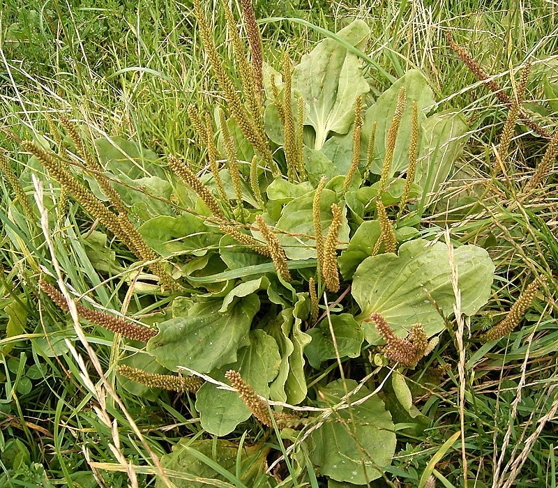
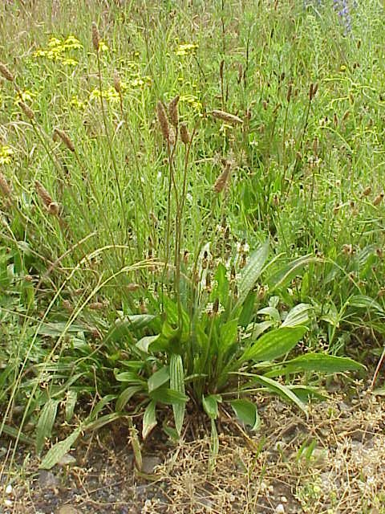
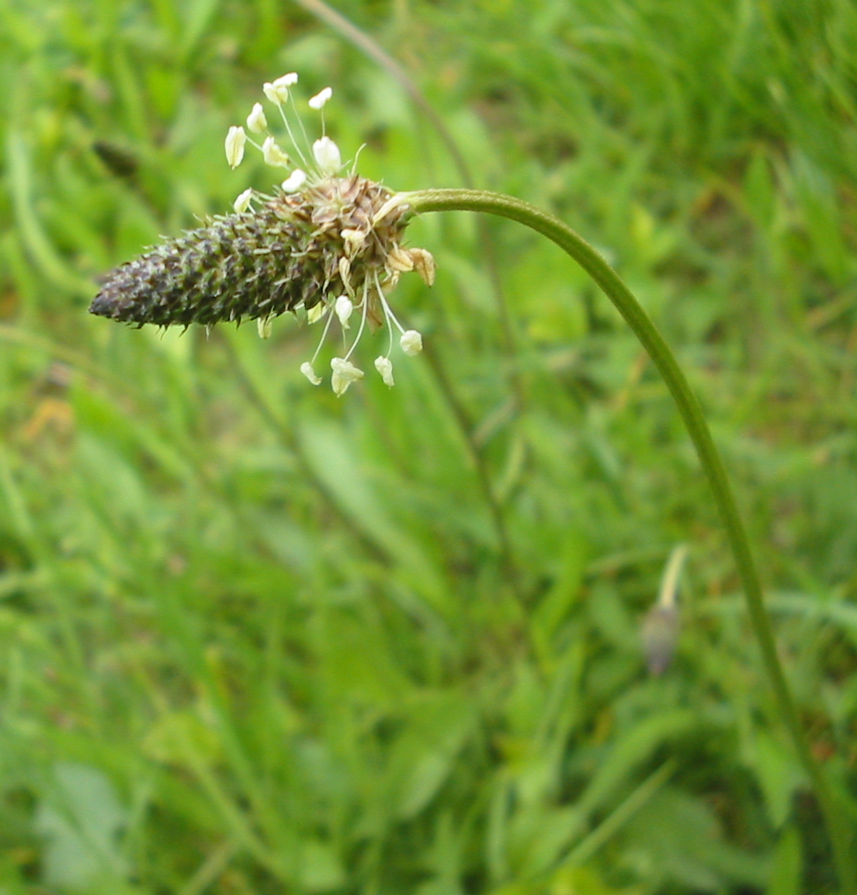

# Plantain

Les plantains poussent partout sur la surface du globe, ils aiment les pâturages, les champs, les bords de chemin et arrivent à pousser dans les sols pauvres, rocailleux ou même régulièrement piétinées. 

_Photo prise par [Frank Vincentz](https://commons.wikimedia.org/wiki/File:Plantago_major_02_ies.jpg)_

# Comment l'identifier

Les feuilles sont vertes, larges et ovales et regroupées en rosette à la base. Elles possèdent des nervures parallèles & en surépaisseurs sur le dessous. Les tiges sont dépourvues de feuilles, avec un épis disposé au sommet.

_Photo prise par [Kurt Stueber](https://commons.wikimedia.org/wiki/File:Plantago_lanceolata_plant.jpg)_

# Comment j'en ai trouvé

J'ai trouvé en me baladant dans la forêt et en bordure de prairie et de route.

J'ai gouté des feuilles, des jeunes et d'autres à l'apparence plus ancienne, qui ont un goût différent, le gout ressemble un peu à celui d'un champignon.

_Photo prise par [Bogdan Giuşcă](https://fr.wikipedia.org/wiki/Fichier:Plantago_lanceolata_bgiu.jpg)_

# Propriétés

Le plantain est utilisable contre toutes les maladies des organes respiratoires, notamment en cas d'engorgement des poumons, de toux ou d'asthme.

Le plantain s'utilise par infusion (1 cuillerée à café bombée de feuilles avec 1/4 de litre d'eau, laisser infuser brièvement), par cataplasme de feuilles broyées ou par sirop.

# Conservation

On conseille l’utilisation de feuilles et fleurs fraîches, ce qui n’est pas compliqué puisque le plantain se récolte 10 mois sur 12, cependant, vous pouvez conserver cette plantes en la faisant sécher le plus rapidement possible après l'avoir récoltée (voir https://fr.wikihow.com/faire-s%C3%A9cher-des-herbes)

## Références

http://www.survie-et-survivalisme.com/plante-comestible-plantain/

http://4emesinge.com/le-plantin-cette-mauvaise-herbe-est-lune-des-plantes-medicinales-les-plus-utiles-de-la-planete/

http://www.gourmandises-sauvages.com/site/une-plante-tres-facile-reconnaitre/

https://fr.wikipedia.org/wiki/Plantain_lanc%C3%A9ol%C3%A9
