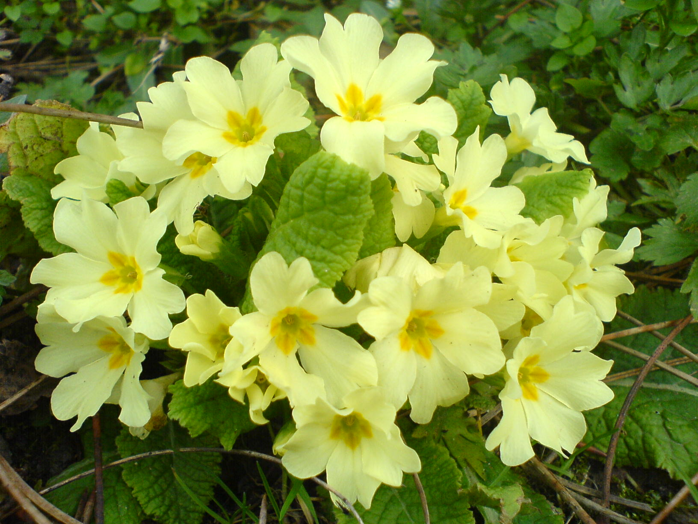
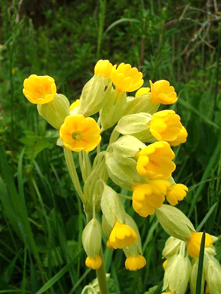

# Primevère

On peut observer des primevères facilement dans les régions de terrain calcaire, sur les talus, au bord des routes, et dans les prairies, petits bouquet de fleurs qui fleurissent assez tôt, au début du printemps.

# Comment l'identifier

L'appelation primevère regroupe 430 espèces, notamment :

La primevère à grandes fleurs, qui est la plus courante, qui se distingue par ses jolies fleurs solitaires.

_Photo de [Pokrajac](https://commons.wikimedia.org/wiki/User:Pokrajac)_

La primevère officinale ayant des fleurs jaunes vif et forment une inflorescence particulière où toutes les tiges des fleurs, les pédoncules sont accrochés à un même point.

_Photo de [Jeffdelonge](https://fr.wikipedia.org/wiki/User:Jeffdelonge)_

# Comment j'en ai trouvé

J'ai trouvé dans le jardin de ma mère, ainsi que dans une prairie adjacente.

J'ai gouté la fleur qui est déliceuse, le gout est assez frais et prononcé, même plusieurs heures après la récolte :-)

# Propriétés

Les feuilles et les fleurs de primevère se consomment en salade, seules ou accompagnées. Toutes les espèces sont comestibles :-)

# Conservation

Vous pouvez conserver cette plante en la faisant sécher le plus rapidement possible après l'avoir récoltée (voir https://fr.wikihow.com/faire-s%C3%A9cher-des-herbes)

## Références

https://unisversnature.blogspot.fr/2013/03/la-fee-du-printemps-la-primevere.html

https://www.aujardin.info/plantes/primula-veris.php

https://fr.wikipedia.org/wiki/Primev%C3%A8re_commune

https://fr.wikipedia.org/wiki/Primev%C3%A8re_officinale

https://fr.wikipedia.org/wiki/Primev%C3%A8re

http://www.gerbeaud.com/jardin/cuisine_fleurs/primeveres_jacinthes.php3
