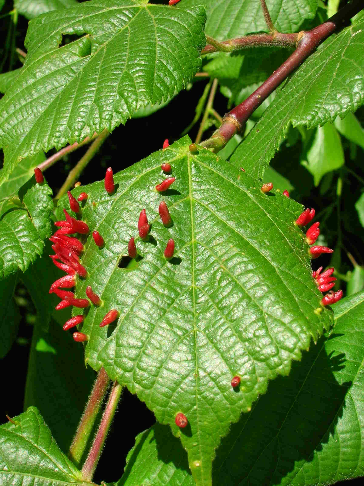

# Tilleul

Le tilleul est un arbre que l'on trouve dans les régions au climat tempéré, il aime les sols frais voir humides ainsi que la mi-ombre, c'est pourquoi l'on peut en trouver dans nos forêts française.

_Photo prise par [JoJan](https://commons.wikimedia.org/wiki/User:JoJan)_

# Comment l'identifier

Le tilleul a un tronc plutôt droit et une silhouette qui ressemble à un cœur renversé. Ses feuilles vertes foncées (puis dorées en automne) ont une forme de coeur. Les fleurs apparaissent à partir du mois de mai jusqu'en été.

_Illustration réalisée par [Carl Axel Magnus Lindman](https://en.wikipedia.org/wiki/fr:Carl_Axel_Magnus_Lindman)_ 

# Comment j'en ai trouvé

Dans une forêt que je fréquente sur un sentier il y a des panneaux indiquants certaines essences d'arbres, le tilleul en faisait partie. J'ai gouté uniquement les feuilles, qui n'ont pas un gout très prononcé mais qui est plutôt bon :)

# Propriétés

Les feuilles peuvent êtres mangées crues, les feuilles peuvent servir à faire des huiles essentielles ainsi que des infusions. L'infusion de tilleul est utilisée pour traiter les maux d'origine nerveuse. Elle calme les migraines et les spasmes. Utilisée en rinçages ou gargarismes, elle atténue les inflammations de la gorge et de la bouche. 

De plus les fibres se trouvant à l'intérieur de l'écorce peuvent servivr pour fabriquer des cordages extrèmement résistants, tout est utile :-) !

# Précautions

Assurez vous que l'arbre ne soit pas malade lors de vos récoltes

_Photo prise par [Roger Griffith](https://commons.wikimedia.org/wiki/User:Rosser1954)_

# Conservation

Vous pouvez conserver les feuilles de cette plante en la faisant sécher le plus rapidement possible après l'avoir récoltée (voir https://fr.wikihow.com/faire-s%C3%A9cher-des-herbes)

## Références

https://www.rustica.fr/articles-jardin/tilleul-tilia-cordata,4964.html

http://www.commentfaiton.com/fiche/voir/19031/comment-connaitre-le-tilleul

https://fr.wikipedia.org/wiki/Tilleul_commun

https://alimentation.ooreka.fr/astuce/voir/453219/feuille-de-tilleul

https://www.passeportsante.net/fr/Solutions/HerbierMedicinal/Plante.aspx?doc=tilleul_hm
